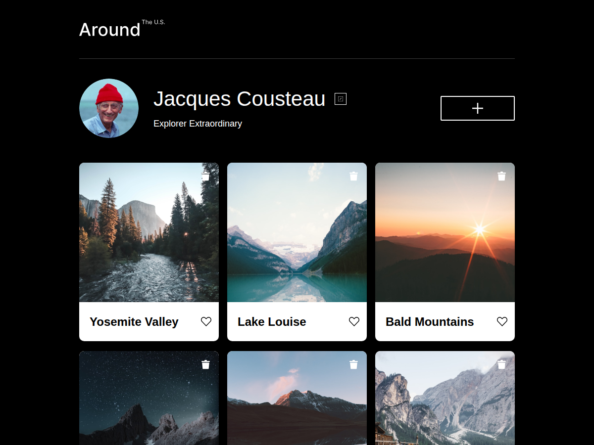
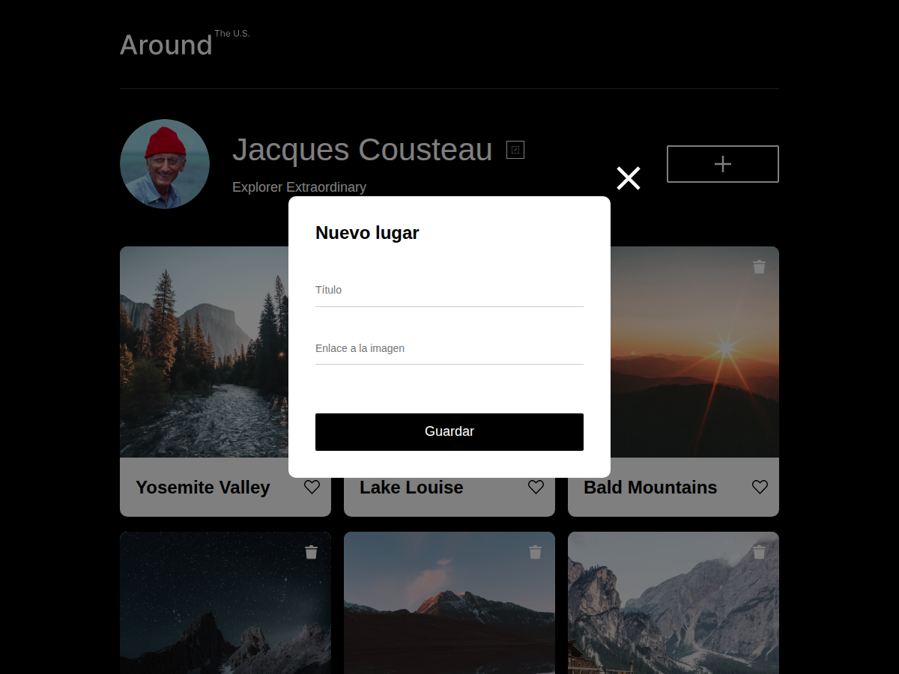

# Alrededor de los EE.UU.

Proyecto del Sprint 10 de TripleTen. Es una pagina interactiva y responsiva en
la que se muestra un perfil de usuario y una galeria de lugares con tarjetas
que se pueden agregar, marcar como favoritas y eliminar, con validacion de
formularios en tiempo real. El codigo JavaScript esta organizado en clases
ES6 y modulos.

## Funcionalidad

- Visualizacion de perfil y seis tarjetas de lugares renderizadas con JavaScript.
- Apertura y cierre del popup "Editar perfil".
- Carga de la informacion actual del perfil dentro del formulario.
- Actualizacion del nombre y la descripcion del perfil al guardar el formulario.
- Formulario para agregar una nueva tarjeta con nombre e imagen.
- Boton de "Me gusta" en cada tarjeta.
- Eliminacion de tarjetas.
- Ventana emergente que muestra la imagen ampliada de cada tarjeta.
- Validacion en tiempo real de los formularios "Editar perfil" y "Nuevo lugar",
  con mensajes de error y boton "Guardar" inactivo mientras los datos no sean
  validos.
- Cierre de las ventanas emergentes al hacer clic en la superposicion o al
  presionar la tecla Esc.
- Diseno responsivo para escritorio y movil.

## Tecnologias utilizadas

- HTML5 semantico.
- CSS con metodologia BEM Flat.
- Flexbox y CSS Grid.
- JavaScript con clases ES6 (`Card`, `FormValidator`) y modulos
  (`import`/`export`).
- Validacion de formularios con la API de restriccion nativa (ValidityState).
- Normalize.css y fuentes Inter.

## Estructura del codigo JavaScript

- `scripts/Card.js` — clase `Card`, encargada de generar cada tarjeta de
  lugar y de su propio comportamiento (like, eliminar, abrir imagen).
- `scripts/FormValidator.js` — clase `FormValidator`, encargada de validar
  un formulario segun un objeto de configuracion.
- `scripts/utils.js` — funciones y controladores compartidos para abrir y
  cerrar las ventanas emergentes.
- `scripts/index.js` — punto de entrada: importa las clases anteriores,
  crea sus instancias y conecta la interfaz.

## Capturas de pantalla

## GitHub Pages

Enlace al sitio publicado:
https://juancol25.github.io/web_project_around/

Repositorio:
https://github.com/Juancol25/web_project_around
